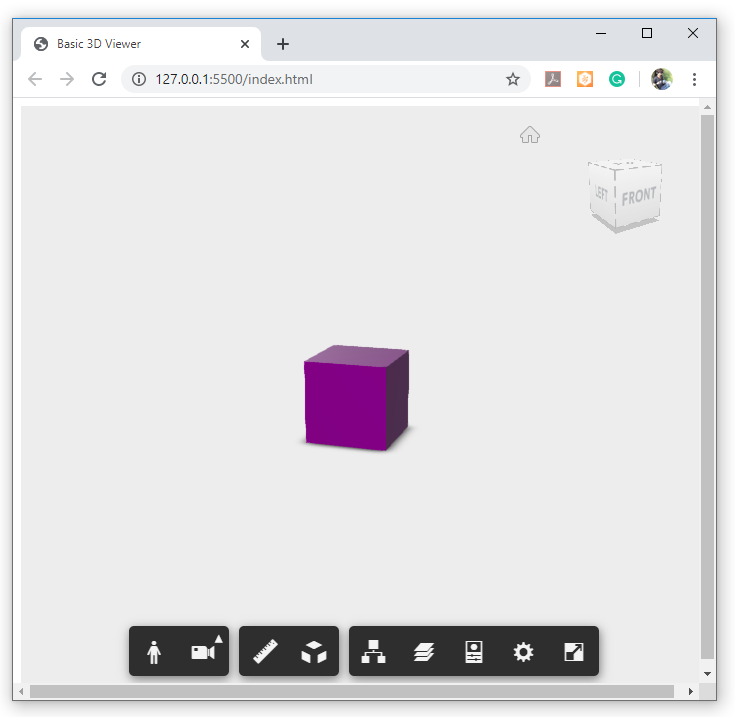

## View 3D Model offline (Autodesk Forge)

## Description
This is a very basic example to demonstrate how one can use the autodesk forge viewer offline to view any 3D model. This has no dependency on autodesk forge API.

I have created a cube(for demo purpose) using AutoCAD and converted it into .svf using a very good VS Code extension named [Autodesk Forge Tools](https://marketplace.visualstudio.com/items?itemName=petrbroz.vscode-forge-tools). 


## Setup
In order to use your own model (extracted .svf format), simply change the value of `document` in `index.html`.
````javascript
var options = {
    'document' : './model/output.svf',
    'env':'Local'
    };
````

Assuming you have [VS Code](https://code.visualstudio.com/)  with [Live Server](https://marketplace.visualstudio.com/items?itemName=ritwickdey.LiveServer) extension installed. 

Run : Download or clone this repository and open the folder in VS Code. Right click on the index.html file and select open with live server.

## Output



#### Written By
[Luqman Quadri](https://github.com/lookquad)
